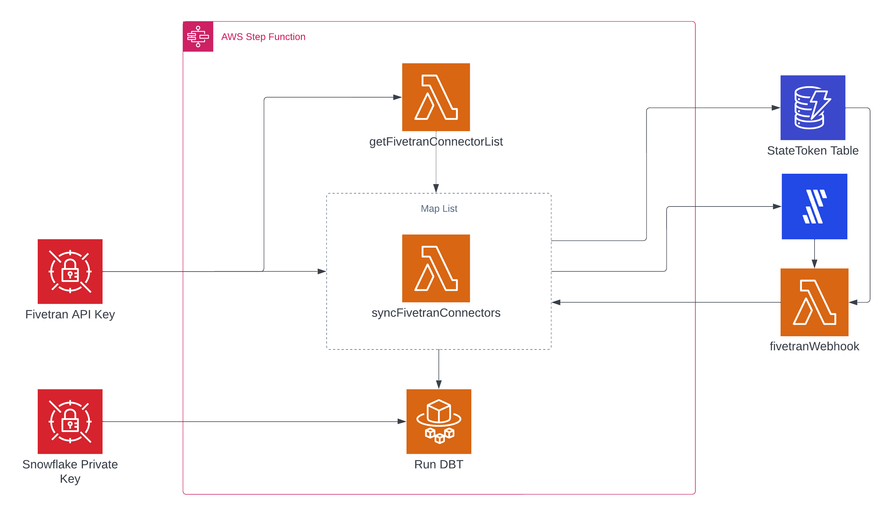

# Introdução ao AWS Step Functions



Este README tem como objetivo expor meus conhecimentos acerca da tecnologia AWS Step Functions como parte do projeto final do curso Engenharia de prompts na AWS com ClaudeAI da DIO. 

## O que é o AWS Step Functions?

É um serviço da AWS que permite criar fluxos de trabalho (workflows) visuais para execução de um determinado processo de negócio. Nele é possível criar workflows - nos quais cada passo executa de forma sequencial - que utilizam vários serviços AWS como EC2, S3 e DynamoDB.

## Exemplo de problema que o serviço resolve

Uma empresa de ecommerce possui um conjunto de sistemas: API de comunicação com banco de dados de produtos, API de comunicação com banco de dados de clientes e aplicação web usada pelos clientes. 

Suponha-se que a API de produtos deve se comunicar com a API de clientes para determinar que um tal produto foi comprado por um cliente específico. 

Essa comunicação é realizada por um sistema de mensageria, porém esse tipo de sistema adiciona uma complexidade maior à comunicação entre serviços.

Nesse contexto, entra o AWS Step Functions, o qual é capaz de criar um fluxo de passos que permita a comunicação entre as duas APIs sem a necessidade de usar um sistema de mensageria, tornando a comunicação mais simples, direta e econômica.

## Como funciona o serviço?

O AWS Step Functions utiliza um fluxo de trabalho (workflow) composto por passos (steps), no qual cada passo recebe uma entrada do passo anterior e envia uma saída para o passo seguinte, funcionando como uma máquina de estados. A comunicação entre passos é feita por meio de arquivos ASL (Amazon States Language) que são similares aos arquivos JSON.

### O que é uma máquina de estados?

Conforme um artigo do site LucidChart: 

Uma máquina de estados é qualquer dispositivo que armazena o status de um objeto em um determinado momento e pode mudar de status ou causar outras ações baseado na entrada que recebe. Estados indicam as diferentes combinações de informações que um objeto pode conter, e não como ele se comporta.

### O que é o Amazon States Language?

Conforme a documentação oficial da AWS:

A Amazon States Language é uma linguagem JSON baseada e estruturada usada para definir sua máquina de estados, uma coleção de estados que pode trabalhar (Taskestados), determinar para quais estados fazer a transição (Choiceestados), interromper uma execução com um erro (Failestados) e assim por diante.

Exemplo de arquivo ASL:

```
{
  "Comment": "An example of the Amazon States Language using a choice state.",
  "StartAt": "FirstState",
  "States": {
    "FirstState": {
      "Type": "Task",
      "Resource": "arn:aws:lambda:us-east-1:123456789012:function:FUNCTION_NAME",
      "Next": "ChoiceState"
    },
    "ChoiceState": {
      "Type" : "Choice",
      "Choices": [
        {
          "Variable": "$.foo",
          "NumericEquals": 1,
          "Next": "FirstMatchState"
        },
        {
          "Variable": "$.foo",
          "NumericEquals": 2,
          "Next": "SecondMatchState"
        }
      ],
      "Default": "DefaultState"
    },

    "FirstMatchState": {
      "Type" : "Task",
      "Resource": "arn:aws:lambda:us-east-1:123456789012:function:OnFirstMatch",
      "Next": "NextState"
    },

    "SecondMatchState": {
      "Type" : "Task",
      "Resource": "arn:aws:lambda:us-east-1:123456789012:function:OnSecondMatch",
      "Next": "NextState"
    },

    "DefaultState": {
      "Type": "Fail",
      "Error": "DefaultStateError",
      "Cause": "No Matches!"
    },

    "NextState": {
      "Type": "Task",
      "Resource": "arn:aws:lambda:us-east-1:123456789012:function:FUNCTION_NAME",
      "End": true
    }
  }
}
```

## Quais são os tipos de workflow no AWS Step Functions?

Conforme documentação oficial da AWS:

- Workflow padrão: Os fluxos de trabalho padrão são ideais para fluxos de trabalho de longa duração (até um ano), duráveis e auditáveis. Você pode recuperar o histórico completo de execução usando o Step Functions API por até 90 dias após a conclusão da execução. [...]

- Workflow expresso: são ideais para cargas de trabalho de processamento de eventos de alto volume, como ingestão de dados de IoT, processamento e transformação de dados de streaming e back-ends de aplicativos móveis. Eles podem ser executados por até cinco minutos. [...]

## Quais são os principais casos de uso hoje?

Conforme documentação oficial da AWS:

- Automatização de funções de segurança e TI: Crie fluxos de trabalho automatizados, incluindo etapas de aprovação manual, para resposta a incidentes de segurança.

- Automatização de processos de extração, transformação e carregamento (ETL): Fazer com que vários trabalhos ETL de longa duração sejam executados em ordem e concluídos com sucesso, sem a necessidade de orquestração manual.

- Orquestração de microsserviços: Combine diversas funções do AWS Lambda em aplicativos e microsserviços serveless responsivos.

- Orquestração de workloads paralelos de grande escala: Itere e processe grandes conjuntos de dados, como logs de segurança, dados de transações ou arquivos de imagem e vídeo.

# ClaudeAI: analogia para explicar o AWS Step Functions

Prompt: No contexto de AWS (Amazon Web Services), me explique como funciona o serviço AWS Step Functions por meio de uma analogia simples de entender.

Resposta: 
---
Imagine que você está montando um móvel novo em casa. O móvel vem com várias peças e você precisa seguir uma série de etapas para montá-lo corretamente. Cada etapa depende da conclusão da etapa anterior.

O AWS Step Functions é como um gerente de projeto para essa montagem de móvel. Ele coordena e gerencia todas as etapas necessárias para concluir a tarefa de forma eficiente.

Imagine que cada etapa da montagem do móvel é uma "função" ou tarefa separada. O AWS Step Functions age como o líder da equipe, garantindo que as tarefas sejam executadas na ordem correta, lidando com qualquer falha ou erro que possa ocorrer durante o processo e mantendo o registro de todo o fluxo de trabalho.

Por exemplo, primeiro você precisa montar a estrutura do móvel, depois adicionar as prateleiras, em seguida pendurar as portas, e finalmente colocar os puxadores. O AWS Step Functions garantiria que essas etapas fossem executadas na ordem correta, de forma automática e confiável.

Dessa forma, o AWS Step Functions simplifica a orquestração de tarefas complexas, permitindo que você se concentre na lógica do seu aplicativo, em vez de ter que gerenciar manualmente todo o fluxo de trabalho.

---

## Referências

[Lucidchart](www.lucidchart.com)

[Docs AWS](https://docs.aws.amazon.com/pt_br/)